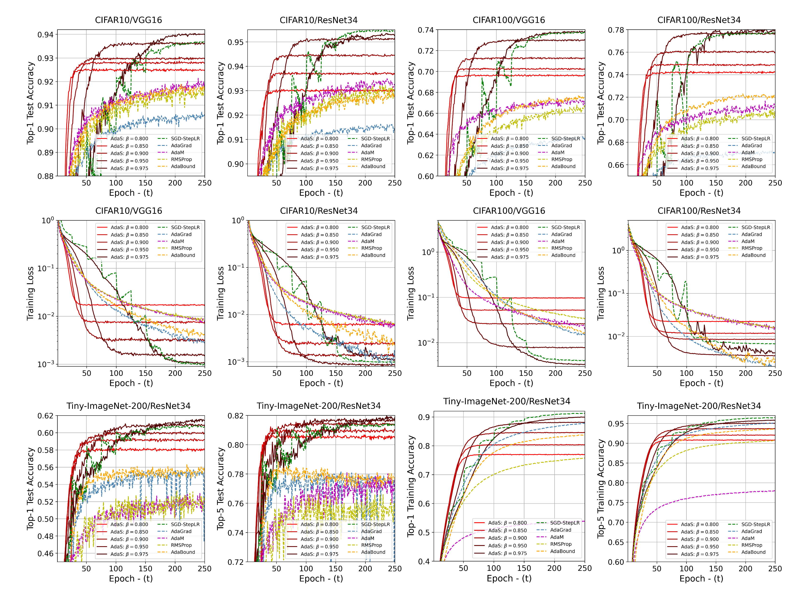
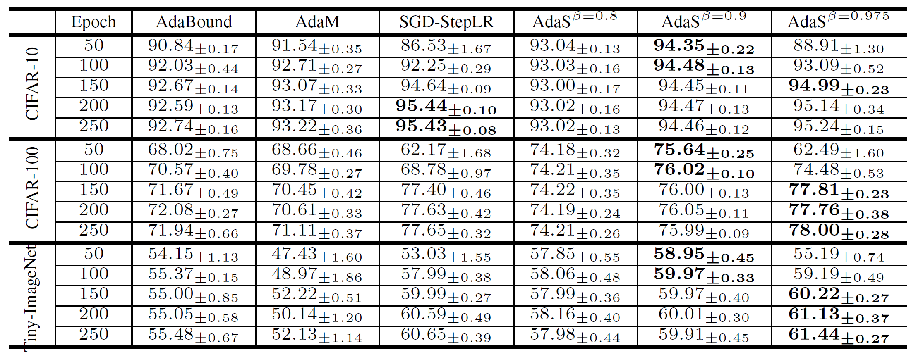

# Adas
Adas Optimization

### Empirical Classification Results on [CIFAR10](https://www.cs.toronto.edu/~kriz/cifar.html), [CIFAR100](https://www.cs.toronto.edu/~kriz/cifar.html) and [Tiny-ImageNet-200](http://cs231n.stanford.edu/tiny-imagenet-200.zip) ###

**Figure 1: Training performance using different optimizers across three datasets and two CNNs**

**Table 1: Image classification performance (test accuracy) with fixed budget epoch of ResNet34 training**

